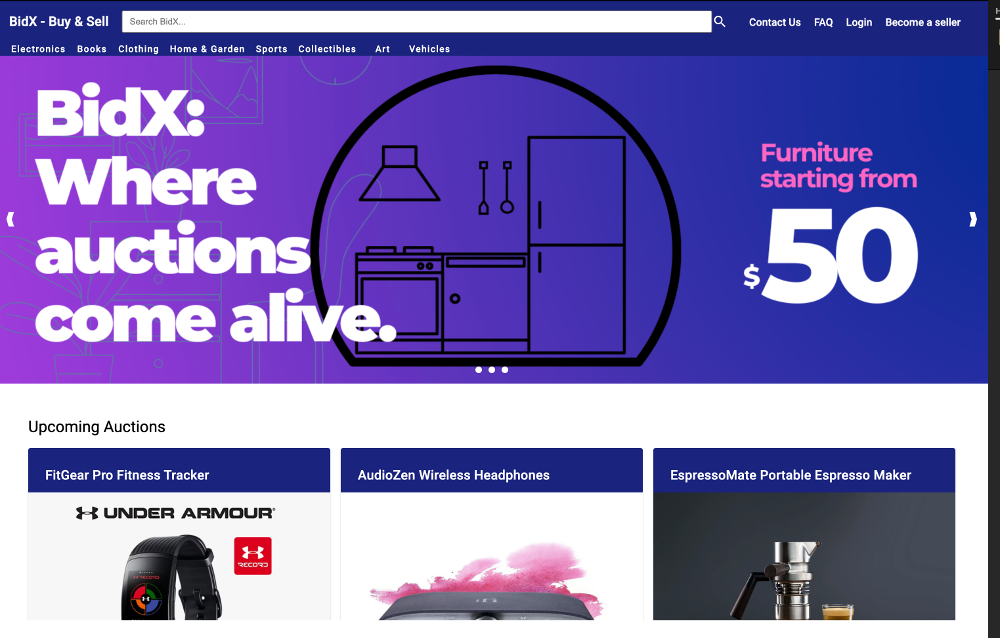

# BidX- Buy & Sell

Welcome to BidX, your online marketplace for buying and selling second-hand items through a dynamic and user-friendly bidding system. BidX is designed to bring together a community of buyers and sellers, offering a wide range of pre-owned items from electronics and books to furniture and collectibles. Our platform caters especially to students, providing an affordable and reliable way to purchase essentials and more.

- _Frontend Deployment:_ <https://main--chimerical-squirrel-737257.netlify.app/>
- _Backend Deployment:_ <https://bidx-backend.onrender.com/>

## ScreenShots of the working web app




## Features Developed

Tasks
- [Product Creation](bidx-frontend/src/app/product-form/)
- [Product Modification](bidx-frontend/src/app/update-product/)
- [Product Deletion](bidx-frontend/src/app/confirmationdialog/)
- [Product Retrieval](bidx-frontend/src/app/product-list/)

## Deployment

To deploy our Angular frontend on Netlify, we configure it for production optimization and manage build commands and redirects directly on the platform, ensuring API URLs are appropriately set in the environment settings.

1. Push "bidx-frontend" code to remote branch (preferably Github).
2. Update [apiUrl](bidx-frontend/src/app/order-details/) with the deployed backend URL.
3. Go to [Netlify](https://www.netlify.com/) and click on "Add new site".
4. Select "Import an existing project" and then "Deploy with Github".
5. Choose the "bidx-frontend" repo pushed earlier.
6. Netlify will detect Angular repo and the "main" branch will be deployed.

For our Spring Boot backend on Render.com, we use Docker to maintain consistent operations, establish necessary environment secrets via the platform's dashboard, and activate automatic deployments upon new commits to streamline and ensure efficient deployment processes.


1. Push "bidx-backend" code to remote branch (preferably Github).
2. Update [WebConfig](https://git.cs.dal.ca/unaeem/csci-5709-grp-03/-/blob/main/bidx-backend/src/main/java/com/example/bidxbackend/config/WebConfig.java?ref_type=heads#L19) with the deployed frontend URL.
3. Go to [Render](https://render.com/) and click on "New Web Service".
4. Select "Build and deploy from a Git repository".
5. Choose the "bidx-backend" repo pushed earlier.
6. Render will detect Spring boot repo (picks up the main branch) and the "main" branch will be deployed.


## Built With

- [Angular](https://angular.io/): A TypeScript-based open-source web application framework for building client-side web applications.
- [Spring Boot Java](https://spring.io/projects/spring-boot): An open-source Java-based framework used to create standalone, production-grade Spring-based Applications.
- [npm](https://www.npmjs.com/): The package manager for JavaScript and the world's largest software registry.
- [Gradle](https://gradle.org/): An open-source build automation tool used for building, testing, and deploying software packages.
- [Material UI](https://material.angular.io/): A UI component library for Angular based on Google's Material Design.
- [Firebase](https://firebase.google.com/): A platform developed by Google for creating mobile and web applications.
- [GitHub](https://github.com/): A web-based platform for version control using Git.
- [Render](https://render.com/): Ideal for backend deployment. *Note: We have used Render to deploy the backend, so initially it might take some time to load.*
- [Docker](https://www.docker.com/): Used for deployment containerization.
- [Netlify](https://www.netlify.com/): Used for frontend deployment.

## Sources Used

### category-bar.component.css

```
.category-container {
  width: 100%;
  overflow-x: auto;
  background-color: #1a237e;
}

.category-toolbar {
  display: flex;
  white-space: nowrap;
  background-color: #1a237e;
  height: 20px;
}

button.mat-button {
  color: #ffffff;
  margin-right: 8px;
  flex-shrink: 0;
}

button.mat-button.active {
  color: #fff;
  background-color: #ffc107;
}

.category-container::-webkit-scrollbar {
  height: 0;
  background: transparent;
}

.category-container {
  -ms-overflow-style: none;
  scrollbar-width: none;
}

@media (max-width: 768px) {
  .hide-on-mobile {
    display: none;
  }

  .hide-on-desktop {
    display: flex;
  }

  button.mat-button {
    padding: 0 8px;
    margin-right: 4px;
    font-size: 0.8rem;
  }

  .category-container {
    background-color: #1a237e;
  }

  .category-toolbar {
    background-color: #1a237e;
  }

  .mat-toolbar.mat-primary {
    background-color: #1a237e;
  }
}

```

The above code is a CSS file that contains the styling for the category bar used in our application and the code is referenced from the below links:

- The code in [CSS Flex Container](https://www.w3schools.com/css/css3_flexbox_container.asp) and [CSS Flex Items](https://www.w3schools.com/css/css3_flexbox_items.asp) was implemented by thoroughly studying the source and understanding its functionality and logic. Then, we adapted the code to suit the requirements of this project.
- [CSS Flex Container](https://www.w3schools.com/css/css3_flexbox_container.asp)'s and [CSS Flex Items](https://www.w3schools.com/css/css3_flexbox_items.asp)'s Code was used because We believed it would be a helpful reference for the starting point for this project. The original code served as a valuable resource in understanding the problem domain, exploring different approaches, and learning specific techniques. We aimed to gain insights into specific techniques, algorithms, and design patterns that could be relevant to the project. Everyone believed that incorporating well-implemented code from external sources would expedite the development process and help us achieve the desired functionality and efficiency.
- [CSS Flex Container](https://www.w3schools.com/css/css3_flexbox_container.asp)'s and [CSS Flex Items](https://www.w3schools.com/css/css3_flexbox_items.asp)'s Code was modified by altering it according to the need of component with major changes in code like adjusting variable names and integrating it with other components. Also, the content was modified based on the requirements of the module.

### card-view.component.html

```
<div class="content" fxLayout="row wrap" fxLayoutGap="16px grid">
    <div
      [fxFlex]="100 / gridColumns + '%'"
      fxFlex.xs="100%"
      fxFlex.sm="50%"
      *ngFor="let product of products"
    >
      <mat-card class="mat-elevation-z4">
        <mat-card-header>
          <mat-card-title>{{ product.title }}</mat-card-title>
        </mat-card-header>
        
        <mat-card-content>
          <p>{{ product.description }}</p>
        </mat-card-content>
        <mat-card-actions>
          <button mat-button>Start Bidding</button>
          <button mat-button>Add to Wishlist</button>
        </mat-card-actions>
      </mat-card>
    </div>
</div>

```

The above code for the card view component is used in displaying a list of items on the page. The user can navigate through the different list and the code is referenced from the [Angular's Flexlayout.](https://github.com/angular/flex-layout)

### header-bar.component.ts

```
import { Component, HostListener } from '@angular/core';
import { MatToolbarModule } from '@angular/material/toolbar';
import { MatButtonModule } from '@angular/material/button';
import { MatIconModule } from '@angular/material/icon';
import { MatInputModule } from '@angular/material/input';
import { MatMenuModule } from '@angular/material/menu';
import { CommonModule } from '@angular/common';
import { Router } from '@angular/router'
import { ContactUsComponent } from '../contact-us/contact-us.component';

@Component({
  selector: 'app-header-bar',
  standalone: true,
  imports: [MatButtonModule, MatToolbarModule, MatIconModule, MatInputModule, MatMenuModule, CommonModule,ContactUsComponent],
  templateUrl: './header-bar.component.html',
  styleUrl: './header-bar.component.css'
})
export class HeaderBarComponent {

  isSmallScreen: boolean = false;

  menuOptions: string[] = [
     'Login', 'Become A Seller', 'Help'];

  @HostListener('window:resize', ['$event'])
  onResize(event: any) {
    this.checkScreenSize();
  }

  ngOnInit() {
    this.checkScreenSize();
  }

  private checkScreenSize() {
    if (typeof window !== 'undefined') {
      this.isSmallScreen = window.innerWidth < 768;
    }
  }
  constructor(private router: Router) {}

  navigateToContactUs() {
    this.router.navigate(['/contact-us']);
  }

  navigateToFaq() {
    this.router.navigate(['/faq']);
  }

}

```

Here the above code for creating the header bar for our landing page is created with the help of the [Angular's Material UI](https://material.angular.io/guide/getting-started) for this part of the code.

### product-details.service.ts


*Lines 11 - 49*


```
@Injectable({
  providedIn: 'root'
})
export class ProductDetailsService {


  // constructor based dependency injection - which loads the default products by
  // specifically injecting an instance of DefaultProducts to handle default product data.
  constructor(defaultProductsProvider: DefaultProducts) {
    this.defaultProducts = defaultProductsProvider.loadDefaultSearchProducts();
  }
```


The code above was created by adapting the code in [Angular dependency injection documentation](https://angular.io/guide/dependency-injection) as shown below:


```
@Injectable({
  providedIn: 'root'
})
class HeroService {}


```


The code in [Angular dependency injection](https://angular.io/guide/dependency-injection) was implemented by going through the official angular documentation and understanding how dependency injection works in angluar project.


The decorator @Injectable was taken from the provided code snippet and it was used with aim of making my code more modular so that Angular can manage the dependency injection life cycle in my project.

## Acknowledgements

Here in our web app, we have used the Image Slider on the home page and the images used there are created using [Canva](https://www.canva.com/).

We would like to acknowledge [Angular](https://angular.io/docs) documentation for the whole front-end code and [Material UI](https://material.angular.io/guide/getting-started) for providing the UI design for the header bar.
